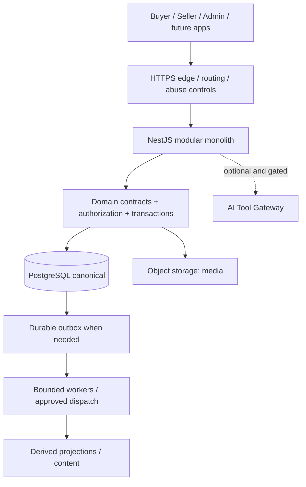

# Architecture và HLD

Applicability hiện hành: [GOV-STATE-001](../governance/CURRENT_STATE.md). Knowledge guidelines không tự cấp adoption/runtime authorization; historical status được giải thích tại đó.

`ENG-ARCH-001` · Applicability: ACCEPTED baseline từ DEC-ARCH-001; ví dụ topology không provisioning.

## Modular monolith first

Một core API NestJS, modules theo business domain, shared contracts; worker entrypoints có thể chạy riêng khi được giao nhưng không tạo service ownership mới. Public Buyer, private Seller/Admin và apps tương lai dùng cùng business rules. Controller xử lý transport; application service orchestration; domain bảo vệ invariants; repository/adapters quản lý persistence/provider. Không copy pricing/permission/ledger logic sang clients.

Diagram là logical architecture; không khẳng định mọi node đang deployed. Một edge provider có thể cung cấp TLS/routing/LB/CDN cùng lúc; không bắt buộc dựng từng box thành sản phẩm riêng. Neon là current PostgreSQL deployment; object storage chứa blobs, DB giữ references/metadata/ownership.

Domain boundaries: D01 Catalog, D02 Pricing, D03 Checkout/Inventory, D04 Finance, D05 Order/Shipping, D06 Returns, D07 Reporting, D08 Access/Policy, D09 Discovery, D10 Operations. Caller dùng public module contract; không sửa trực tiếp bảng/aggregate do domain khác sở hữu. Shared infrastructure không trở thành god module.

## Stateless và stateful

Stateless API không phụ thuộc local process memory để giữ correctness giữa requests. Identity/session verification, durable idempotency, business state ở authoritative stores. Horizontal instances phải xử lý request bất kỳ; local cache chỉ optimization có bounded stale behavior. Stateless không có nghĩa hệ thống không có state.

PostgreSQL, object storage và durable queues là stateful: cần backup, recovery, ownership, versioning và consistency. WebSocket kết nối cũng stateful trên thời gian sống connection; reconnect không bảo đảm process cũ còn tồn tại. In-memory reservations/payment results không hợp lệ thay durable transaction. Sticky sessions không sửa mất dữ liệu khi process chết.

## Khi nào được extract microservice — LATER

`ARCH-EXTRACT-001` (PROPOSED criteria): chỉ đề xuất khi có domain boundary ổn định, evidence bottleneck/independent deployment hoặc isolation need, team ownership/on-call, service SLO và budget. Đo latency/throughput/DB contention trước và sau dự kiến; thử tối ưu query/index/batching/monolith scaling trước.

ADR extraction phải định nghĩa API/events versioning, một canonical writer mỗi aggregate, idempotency/retry, data migration/cutover/recovery, observability và incident ownership. Cross-service transaction mất local atomicity; saga compensation không phải rollback thời gian và không đảo được mọi side effect. Không chọn microservices theo số users giả hoặc để sơ đồ trông lớn.

## Advanced boundaries — LATER

CQRS: tách command/read models; projection hiện hữu không tự yêu cầu hai DB/framework CQRS. Event sourcing: lưu events làm truth và rebuild state, khác outbox; không tự chuyển ledger sang event sourcing. Gossip: disseminate membership/state theo peers, không bảo đảm financial consensus. Multi-region active-active cần conflict model, latency/cost và single-writer/consensus design; chưa V1.

HLD cần user journeys, trust boundaries, domain ownership, dependencies, failure modes, deployment assumptions, data lifecycle và gates. LLD mô tả API/schema/state machines/locks/algorithms cho slice đã giao; xem ENG-LLD-001. Trace: D01–D10, GATE-CONTRACT-001, GATE-OPS-001.