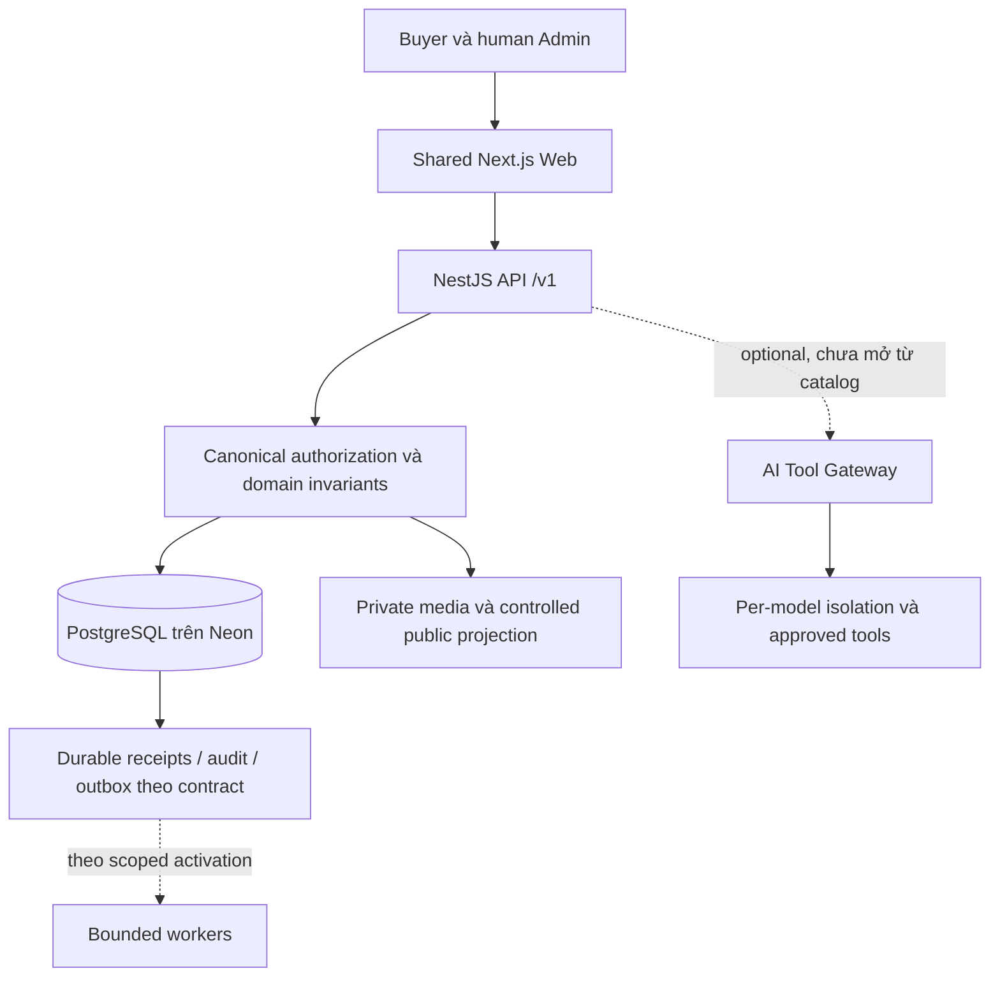

# Cootton Knowledge System — repository edition v0.2.0

> **FIX04-READ-OPS-001 · 2026-10-09:** source SDK fix `988c8a83…`, API candidate `7a053d12…`; CI/build PASS, actual-account1.000 reads/0SDK warnings, HTTP read/negative checks PASS. Read [scoped SDK/HTTP evidence](../operations/API04_SDK_HTTP_OPERATIONS_EVIDENCE_2026_10_09.md) and [observed config / proposed thresholds](../operations/API04_RUNTIME_CONFIG_AND_THRESHOLDS_2026_10_09.md). API588 evidence below remains historical. ACT006 remains serving; no serving deployment/traffic change. Thresholds/deadline changes are PROPOSED, full gates and API04-RECOVERY-002 remain OPEN. **NOT READY TO DEPLOY**.

> **PREP04-CANDIDATE-001 · 2026-10-09:** [Candidate/checkpoint](../operations/API04_CANDIDATE_REVIEW_2026_10_09.md) records API/Web immutable registry digests built from e06d3de8, actual API service-account metadata + 200 generation-pinned reads PASS on two retained fixtures, and candidate identical-input encoder repeatability PASS for one clip. Warning reproduced: 200 SDK listener warnings; leak/root-cause/remedy remains OPEN. [Rollback runbook](../operations/API04_ROLLBACK_RUNBOOK.md) separates containment from traffic-only regression. Older UNBUILT/unrecorded/all-runtime-reads-untested notices are historical for these specific scenarios. Actual create/412 under service identity, full identity/config/HTTP/rollback/operations evidence and API04-RECOVERY-002 remain OPEN. **NOT READY TO DEPLOY**. Build/diagnostic workloads ran; serving API/Web traffic, IAM, SQL and product state were not changed by this preparation. No new ACCEPTED decision or rollout approval.

> **REVIEW-PR26-002 · 2026-10-08:** This revision reconciles PR26 release-preparation documents with main `9c084c12` and preserves the knowledge edition. References to an unmerged PR26 at `cad72a77` describe the initial knowledge-review snapshot, not a permanent current-state assertion. After this PR merges, read the current [release preparation](../operations/API04_RELEASE_PREPARATION_2026_10_08.md) and [cloud checkpoint](../operations/API04_CLOUD_READ_EVIDENCE_2026_10_08.md) on main. The owner authorized documentation review/merge; proposed work packages and runtime/release gaps remain unchanged. No script, application source, migration or runtime action is introduced by this merge.

`KN-MASTER-002` · Review ngày 2026-10-08 · Trạng thái bộ tài liệu: PROPOSED FOR REVIEW.

Đây là điểm đọc đầu tiên của **bộ kiến thức**, sau đó Work phải tuân theo [COOTTON_MASTER_PLAN](../../COOTTON_MASTER_PLAN.md) và thứ tự đọc bắt buộc của repository. Không thay V001, contracts hay các quyết định đã có bằng bản tóm tắt này.

## Kết luận kiến trúc

Cootton đã có nền móng và luồng catalog; cần hoàn thiện bằng chứng và vận hành trước khi mở thêm chức năng. NestJS/TypeScript modular monolith, shared Next.js Web và PostgreSQL canonical là baseline đã chốt. Neon là database hiện dùng; Cloud SQL là hướng chuyển đổi có điều kiện. Launch một seller Cootton, website trước payment; CP top-up paused, CP/VC/VCS inactive. AI optional, core hoạt động khi không có AI.

Sơ đồ mô tả quan hệ logic. Không chứng minh các worker hay AI đang chạy. Media/private data, quyền và trạng thái publish do backend quyết định; host, URL, nhãn role và AI không tự cấp quyền. Cache là dữ liệu dẫn xuất, không thay database hoặc ledger.

## Năm lớp kiến thức thống nhất

| Lớp | Trách nhiệm | Nguồn có thẩm quyền |
|---|---|---|
| Yêu cầu và quyết định | Phạm vi launch, owner approval, invariants | V001, CURRENT_STATE, DECISIONS, D01–D10 |
| Contracts | Request/response, quyền, dữ liệu, side effects, retry/conflict | CORE, API endpoint/authz/transaction/media contracts, OpenAPI |
| Thiết kế và source | Framework, modules, database/adapters, cache, frontend | ADR, docs/engineering, apps và migrations đã áp dụng |
| Evidence và release | Source/CI/isolated/runtime/browser, rollback, reviewer signoff | Scoped checkpoints, GATE_EVIDENCE, deployment plan |
| Thư viện học tập | Patterns, Spring/Java, AI/RAG, scaling | docs/engineering và knowledge capture; adoption phải có lý do và scope |

Một ý tưởng đi từ thư viện → đề xuất áp dụng → contract/ADR → implementation theo authorization → evidence → gate/release. Không đi thẳng từ “đã học” sang production.

## Cửa đọc theo nhu cầu

1. [Review và các sửa đổi so với v0.1.0](REVIEW_REPORT.md).
2. [Bản đồ kiến thức và contract](KNOWLEDGE_MAP.md).
3. [Kế hoạch theo dependency và checkpoint](DETAILED_PLAN.md).
4. [Backlog có deliverable và tiêu chí hoàn tất](EXECUTION_BACKLOG.md).
5. [Các quyết định còn mở và ma trận bằng chứng](DECISIONS_AND_EVIDENCE.md).
6. [Nguồn, lời người dùng và giới hạn truy cập](SOURCE_EVIDENCE_REGISTER.md).

## Current checkpoint và giới hạn

Main được review tại `e06d3de8e74bc7cb431734d32d339ef63e1824ef`. ACT006 là runtime checkpoint ghi nhận trong repository, không phải source API02–04 mới đã được rollout. SQL001–006 đã áp dụng theo checkpoint, phải giữ immutable. [PR26](https://github.com/Cootton/CoottonPlatform/pull/26) head `cad72a773383a0ef145dcc1467ab5d3ea52030a4` là **unmerged overlay** được đọc riêng: browser Admin đã hồi phục trong một phiên; nguyên nhân/recurrence vẫn OPEN, cấu hình cloud được đọc nhưng effective runtime operations và release blockers còn mở.

Task này review tài liệu/source và lập kế hoạch; không chạy lại application tests hay kiểm chứng production. Không gate nào được nâng PASS bởi bộ kiến thức. Phê duyệt tổng quát của user được lưu ở source register; chỉ dẫn chiếu ACCEPTED đã có trong repository, không tự cấp ACCEPTED cho đề xuất mới.

## Adoption boundary

V1: modular monolith, bounded queries/cache, canonical authorization, durable retry/transactions, private/public projections, targeted verification. Redis, dedicated API Gateway, SSE/WebSocket và circuit breaker implementation chỉ PROPOSED khi có use case/measurement. Kafka, event sourcing, sharding, microservices, Kubernetes, multi-region active-active, graph/vector cluster là LATER. Không thêm chúng để hoàn thành một checklist học tập.

Changelog v0.2.0: chuyển từ knowledge skeleton sang repository mapping; sửa trạng thái đã triển khai/đã chốt; đưa release readiness lên trước commerce; giữ v0.1.0 làm artifact lịch sử. V001 vẫn cập nhật tại chỗ, không tạo V002.
